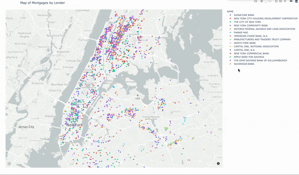

# Acris EDA

[Demo of app available at https://acris-lenders.netlify.app/](https://acris-lenders.netlify.app/)

## Backgound

July 2019, NY State Governor Cuomo announced a new plan to cut greenhouse gas emissions 40% by 2030, named [The Climate Leadership and Community Protection Act](https://climate.ny.gov/). 

Part of this plan requires retrofitting multifamily properties with energy efficient utilities/appliances. One such program is the [PACE](https://www.energy.gov/eere/slsc/property-assessed-clean-energy-programs) financing program, which allows property owners to finance the upfront costs of the retrofit. 

These loans are typically paid back via an increased property tax bill, effectively making the PACE lien senior to current liens. In order to proceed, as of now, current lien holders will have to agree to subordinate their lien to the PACE lien. Depending on how many debt holders there are, this could be an onerous task.

This is an initial exploration of mortgage note holders in NYC with data from Acris.

This project is just beginning and will be updated as we progress.